+++
date = "2015-06-26T13:24:13-05:00"
draft = false
title = "Tutorial"
[menu.main]
Identifier = "Android-Tutorial"
parent = "Android"
+++

# Overview  

Welcome the ClearBlade Tutorial.  The goal of this tutorial is not to bore you with tedious details of client side languages but instead quickly walk you through the basics of creating a highly scalable and flexible backend.  

When you are done with this tutorial you’ll be ready to get started building your own mobile app or connected device ready to be part of the internet of things.  Concepts include data management, API creation, messaging, triggering of events, timers for scheduled work all done in a secure coherent manner.  Lets get started!

### Setup
Before starting we need to make sure you have access to a ClearBlade platform instance.  Many organizations have their own private, hybrid, or public instances which can made available to you.  If your not sure or don't have access yet, you can always use a free trial account at the public SaaS ClearBlade platform instance at https://platform.clearblade.com 

**Now - Lets get started!**

## Part 1 - Create a System  

In this first part we are going to build our first system.  A system represents the backend components of application server, database, message broker, and user registry all brought together to be easily utilized and managed.

1. Click the New button located in the top left part of the menu bar  
   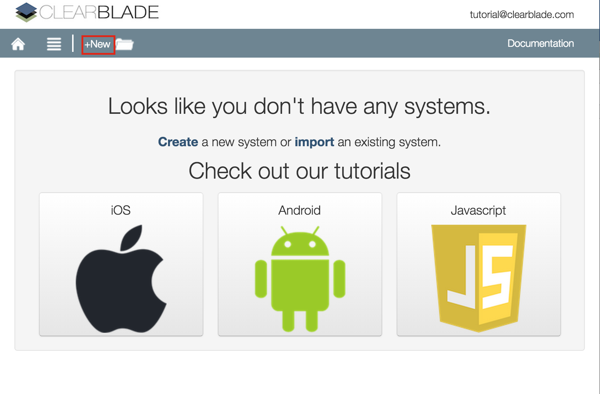</img>

2. Provide a name “Tutorial” and description “My First System”  
   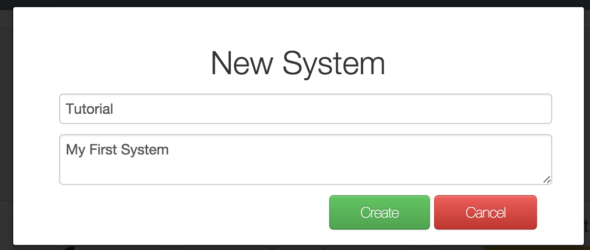</img>

3. Click __Create!__  
4. View your system settings by clicking the wrench icon located in the top right of your new system.  
   </img>  
5. Capture your systemKey and systemSecret - we will use those values in our clients  
__NOTE:__ User Session Token TTL - provides you the ability to customize how long the user tokens are operational.  
   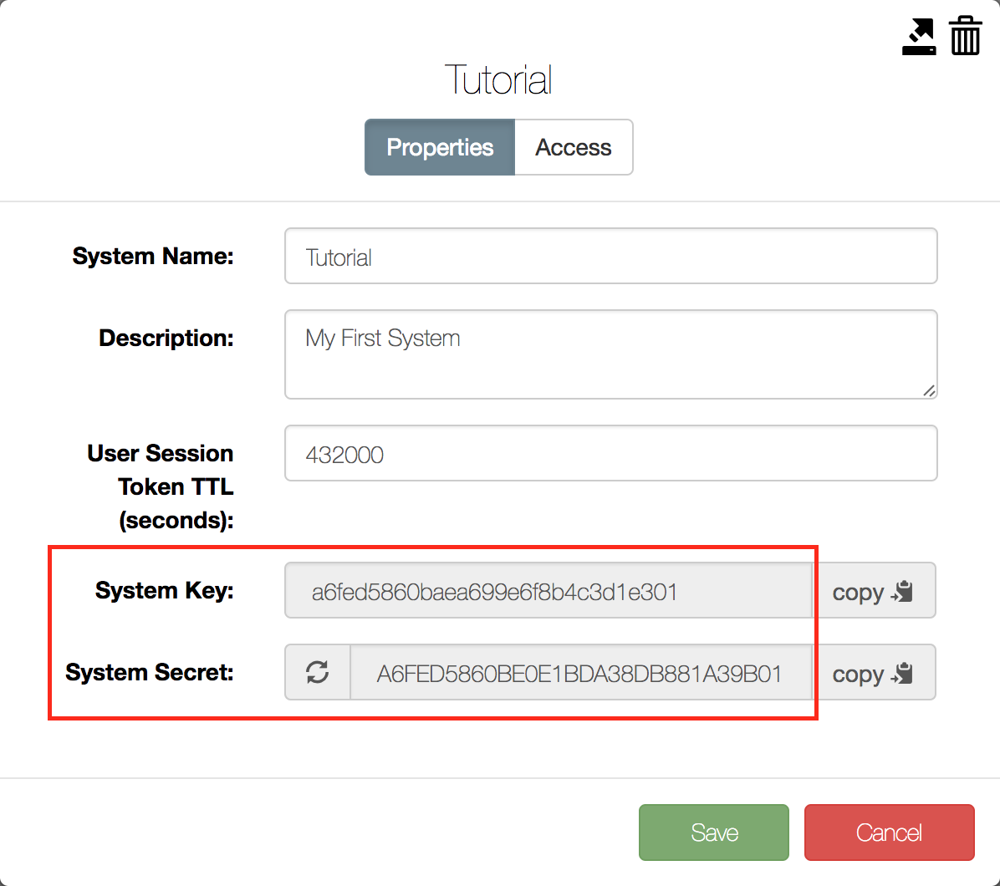</img>  
6. **Before we continue you need to download the Android tutorial source files from Github https://github.com/ClearBlade/Tutorial-Android** </img>            
  1. Clone the repository with the command <code>git clone https://github.com/ClearBlade/Tutorial-Android.git</code>
  2. Start up Android Studio and on the welcome screen select, 'Open an existing Android Studio Project' (OR go to File -> Open) and browse to the Tutorial-Android directory and hit open
  3. In Android Studio navigate to Tutorial-Android -> app -> src -> main -> java -> tutorial.clearblade.com.clearbladetutorial
  4. Open the PlatformConstants.java file and add your systemkey, systemsecret, platformURL, messagingURL, and email address  and **save**
<pre>
    public final static String SYSTEMKEY = "YOUR_SYSTEMKEY";
    public final static String SYSTEMSECRET = "YOUR_SYSTEMSECRET";
    public final static String PLATFORM_URL = "YOUR_PLATFORMURL"; //ex. http://192.168.1.68:9000
    public final static String MESSAGING_URL = "YOUR_MESSAGINGURL:MESSAGING_PORT"; //ex. 192.168.1.68:1883
    public static String USER_EMAIL = "YOUR_EMAIL_ADDRESS";
</pre>
7. Launch your client by hitting the **RUN** button  
8. The final step of Part 1 is to initialize to the ClearBlade Platform anonymously.  Follow the instructions in your client UI to complete that task  


In some cases this tutorial will show examples of the client in Javascript.  Expect comparable user interface exists in the Android and iOS clients.  
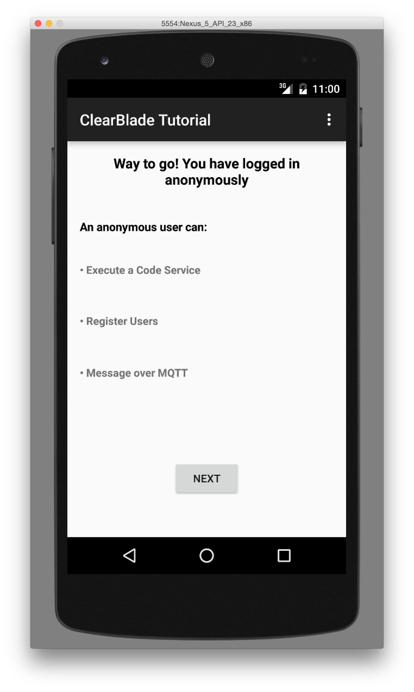</img>  
Lesson learned -  
- How to create a new system in the ClearBlade platform  
- How to find the basic properties of a system  
- How to log in anonymously so that all activities are tracked  


## Part 2 - Create a user  

The attribute that should be first in the minds of all enterprise platform developers is security.  Before anything meaningful happens with ClearBlade we must start to define the permissions model.  The permissions model in the ClearBlade platform is role-based.    

Although you have already created a developer account to login on the platform each system you create will have its own user registry. 
For Part 2 we will create our first user and then connect to our system as that user.  To get the basic understanding of users  

1. Click the Auth tab Add a new user (email and password)  
   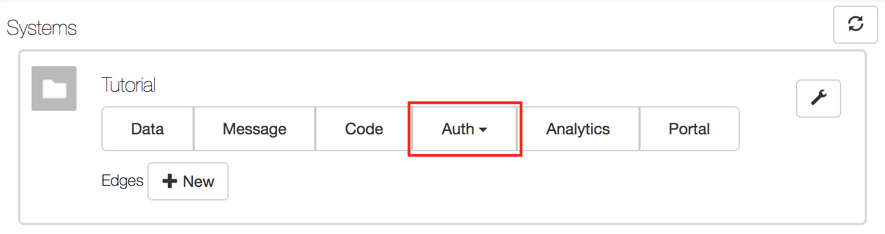</img>  
2. Add a new user by Clicking the **+ User** icon  
   </img>  
3. Set the user email to **“test@clearblade.com”**  
4. Set the user password to **“clearblade”**  
   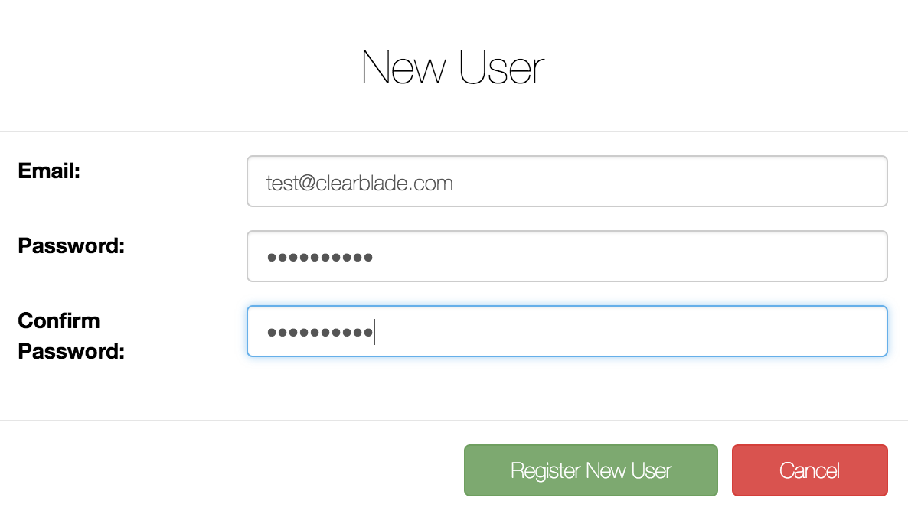</img>  
5. Your user is now created and has been given the role of “Authenticated”.  To learn more about users and roles see the [documentation](../../../1-platform_concepts/Users/)  
6. Go back to you client app and execute the Part 2 login action 

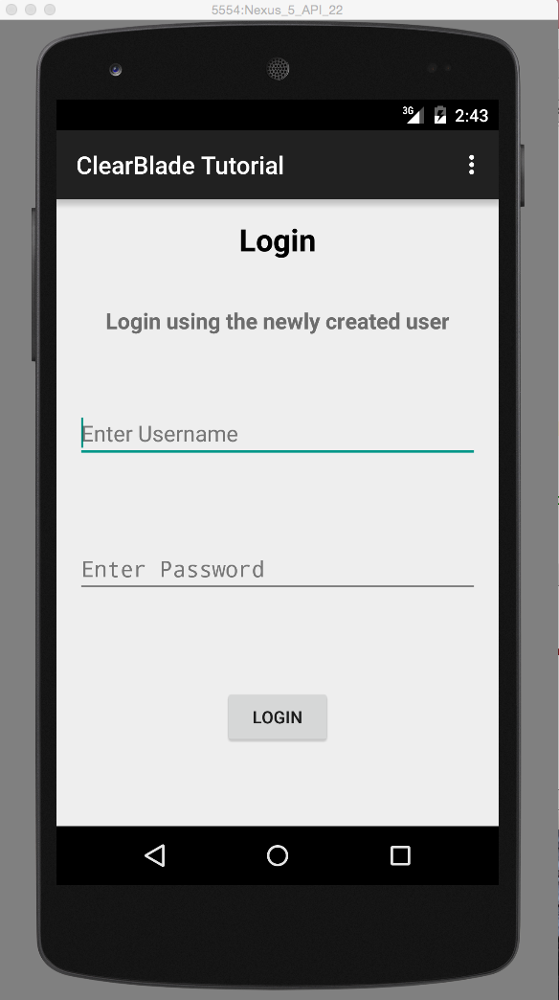</img>    

Lessons Learned -   
- How to navigate to users and roles   
- Create new users  
- Demonstrate connection to the ClearBlade Platform  

## Part 3 - Create a collection  

Now its time to create and work with data.  In this part we will define a new custom collection that is similar to a table found in a SQL database.  

1. Navigate to the system data section by clicking on Data from the menubar  
   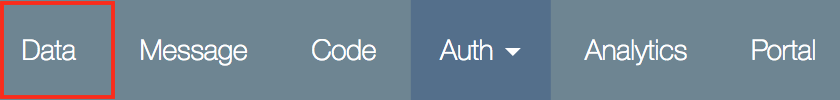</img>  
2. In the upper left click the +New button to create a new collection  
   </img>  
3. This data for this collection will be stored inside the ClearBlade Platform so select **“Cloud”** and give the new collection a Name of **“Weather”**.  
   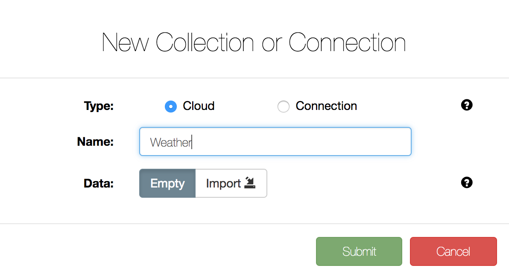</img>  
4. Create new columns for the collection by clicking on the +Column button.  
   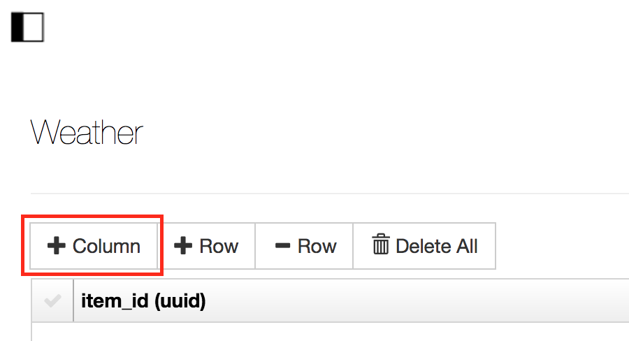</img>  
5. Name the new column **“city”** and set the type to **“String”**  
   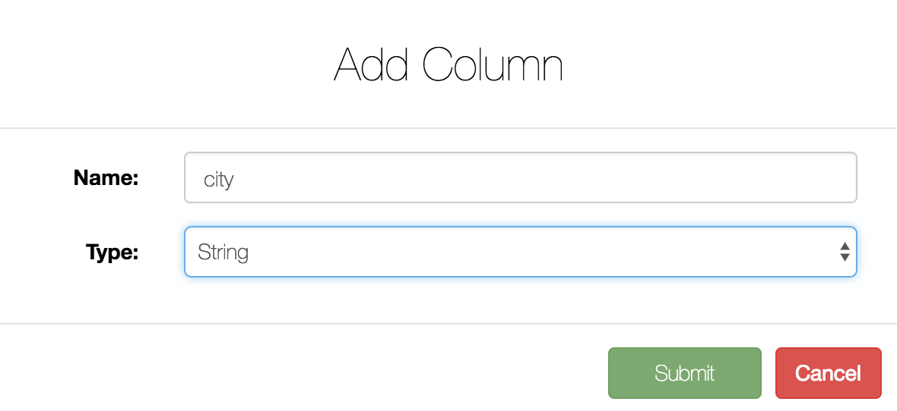</img>  
6. Repeat the process to add the following additional columns  
a. state: String  
b. country : String  
c. temperature : int  
d. weather : String  
   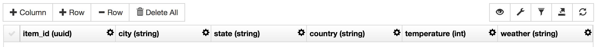</img>  
7. Add a row of data by clicking on  
   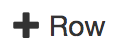</img>  
8. Insert a row for **Austin, Tx, USA, 102, Sunny**  
9. Insert a row for **New York, Ny, USA, 77, Cloudy**  
10. By default security is turned off for all assets you create in the platform. The next few steps enable your users to access this new data structure via simple REST based calls.  
a. Click the collections settings icon found in the upper right  
</img>  
b. Choose the Security tab in settings window.  
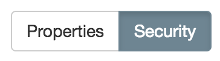</img>  
c. Click +Role icon   
</img>  
d. Type Authenticated to select the role associated with our test user.   
e. Then give the Authenticated role CRUD permissions.  
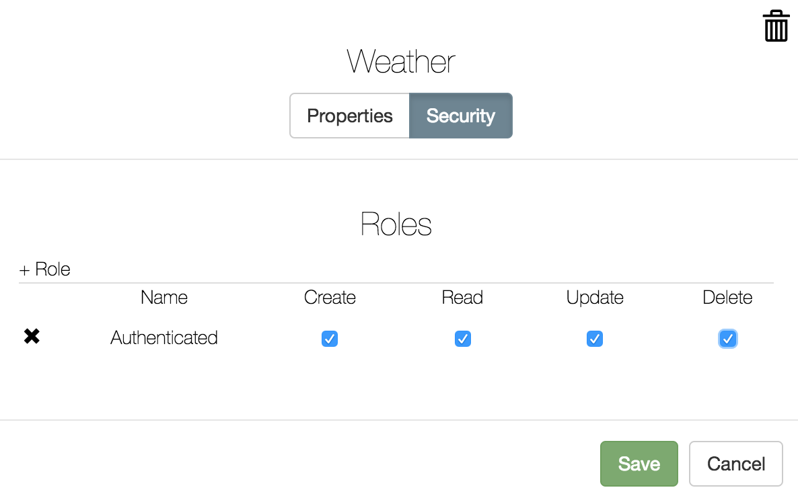</img>  
11. You now have defined, populated and authorized a new data structure.  
12. Finally, you need to add the newly created collection id to the `PlatformConstants.java`. You get this id from the top right of the collection screen. Simply click on it to copy to the clipboard.

<pre>
    public final static String COLLECTIONID = "dc80b68e0bf8bcaaa3baebd8f19501";
</pre>


**NOTE:** For more information on the client app you can checkout the readme available on the Tutorial GitHub page  
</img>  

Lessons Learned -   
- How to create data structure   
- Applying authorities to those data structures  
- Fetching those data structures in your client application  

## Part 4 - Create a service  

Best practice for building many apps includes creating an application layer of services.  In these services you have the ability to implement your API and build highly scalable business logic.  In this part we will create a simple service in the ClearBlade platform.  

1. Navigate to the system code section by clicking on Code from the menubar  
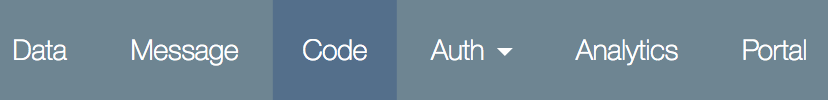</img>  
2. Click the + New button to open the new service dialog  
</img>
3. Enter the name of **“ServicePart4”**  
4. Click **+Add** Parameter to add an input parameter named "city" to the service  
5. Click **Create** to add the new service to your system  
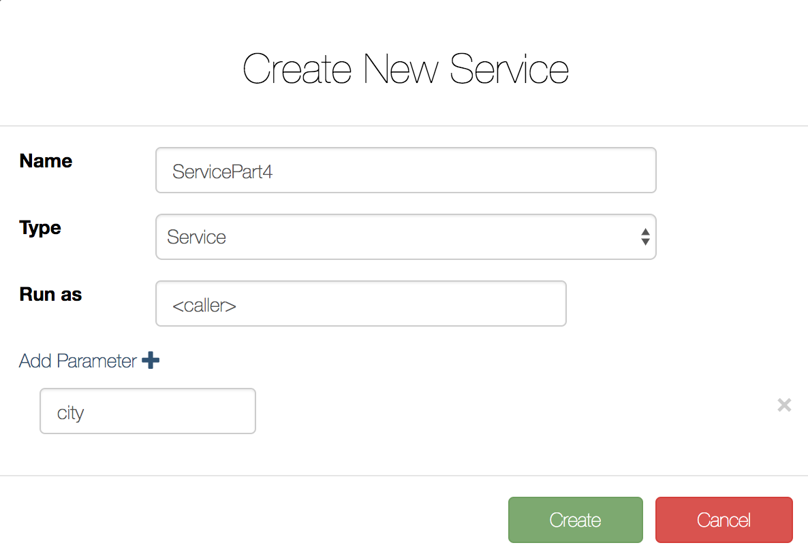</img>  
6. In your newly created service add the following lines of code  

``` javascript 
function ServicePart4(req, resp){
    resp.success("Welcome "+req.userEmail+" from "+req.params.city);
}
```  

7. Add data to test with by clicking **“Test Parameters”** located in the bottom right  
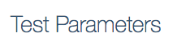</img>
8. In the parameters dialog add “Austin” as your city value. **Note:** These values can be of different types.  In this case it’s important to include the parentheses around your string value.  
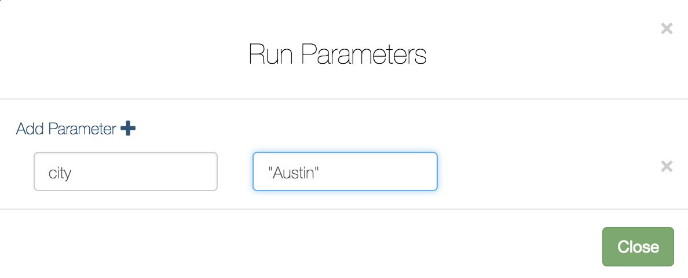</img>  
9. Click **“Close”** when finished  
10. To test your code click the button labeled **“Save and Test”**  
 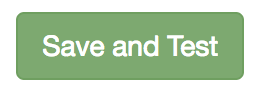</img>  
11. The response should now be presented to you.  <br>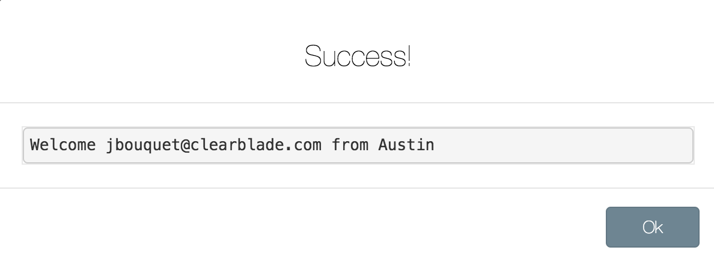</img> <br>
The code you added performed a basic Hello world operation. There were several objects used that allowed for this interaction    
a. **req** - The request object contains a number of helpful attributes.  Including information about the user, parameters passed to the user and core system attributes  
b. **resp** - The response object is how services are exited.  Calling resp.success send back the payload to your calling endpoint  
12. As services get complex, it’s helpful to view logs of your service execution.  Turn on logging in your service by   
  *  Click the service settings icon
  </img>  
  *  Select Logging enabled to YES.
  <br>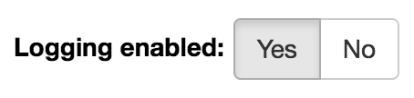</img>  
  *  Click the Requires tab and add the log library
<br>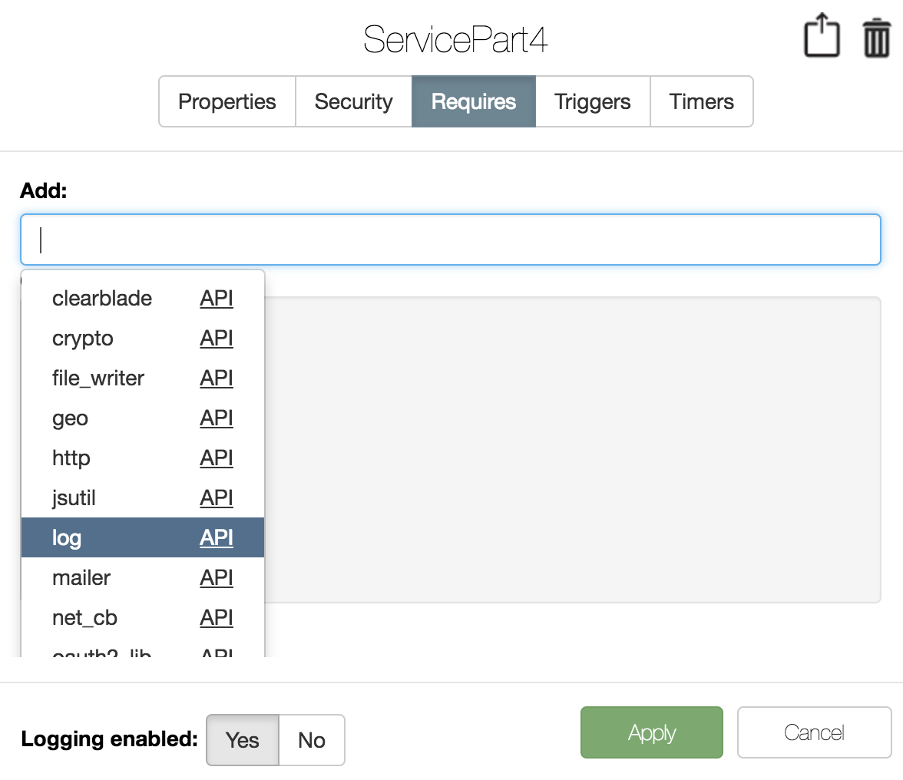</img>
  *  Choose Apply 
  *  Now add update your service to write the request object to the log
  
  	```javascript  
	function ServicePart4(req, resp){
    	log("Our request object is: "+JSON.stringify(req));
    	resp.success("Welcome "+req.userEmail+" from "+req.params.city);
	}
	```  

13. View your service logs by completing the following steps:  
a. Once again call the “Save and Test” operation  
b. Close the “Success” dialog   
c. Click the logs icon in the top right  
</img>  
d. Choose the service execution run from the dropdown  
e. The results of the log statement we wrote should now be visible.  In this case we have printed the req object for inspection.  Review the results  
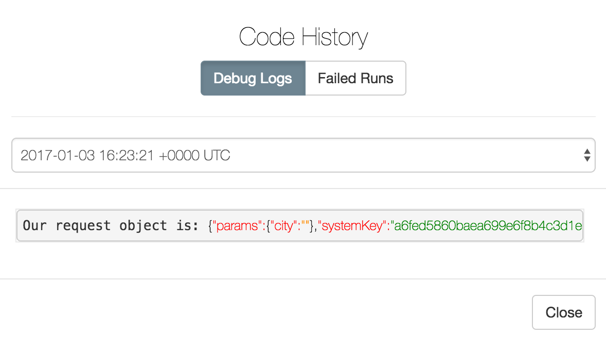</img>  
14. The last step is now to make this service available for your end users. Update permissions for the service to execute for authenticated users  
a. Click the service settings icon found in the upper right  
 </img>   
b. Choose the Security tab in settings window.  
c. Click +Role icon  
</img>    
d. Type Authenticated to select the role associated with our test user.    
e. Then give the Authenticated role Execute permissions.  
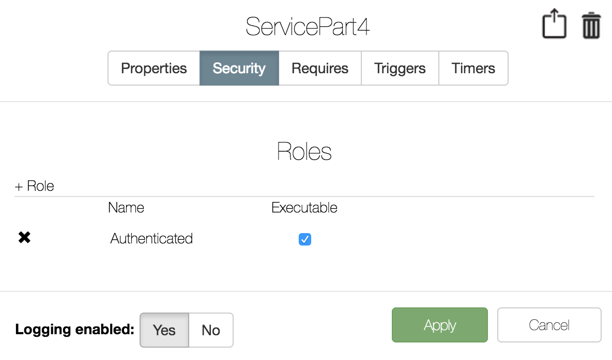</img>  
15. Now you’re ready to test in your client app.  Go and complete Part 4 validation   

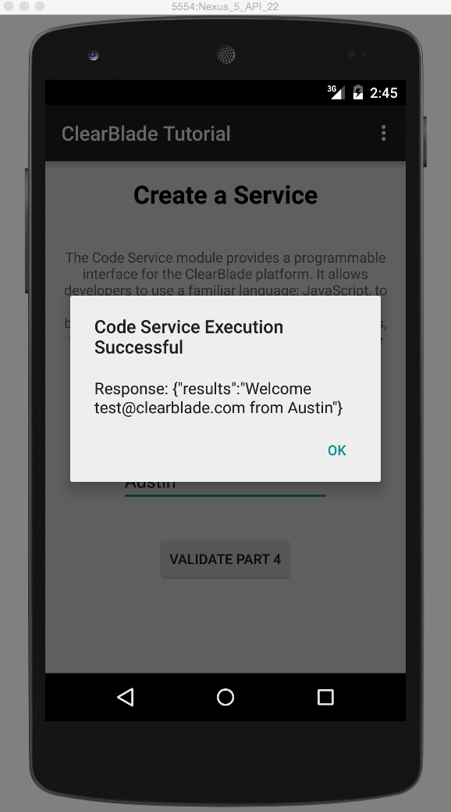</img>  

Lessons Learned -   
- How to create a new service    
- How to pass and return data from a new service endpoint  
- How to debug the service via logging  
- How to securely expose the service to outside users  


## Part 5 - Create business logic  

Services can provide much more than just helloworld capability.  They have the power to implement your complete API.  In this next module we will do some basic data access and implement some simple business rules.  

1. Using the steps from part 4 - Create a new service, named **‘ServicePart5’** and add parameters city, state, and country.   
2. Copy and insert the following code into the newly created service    
```javascript
function ServicePart5(req, resp){
    
    var city = req.params.city;
    var state = req.params.state;
    var country = req.params.country;
    
    ClearBlade.init({request:req});
    
    var updateCollection = function() {
        var collection = ClearBlade.Collection({collectionName:"Weather"});
        var newRow = {
            city: city,
            state: state,
            country: country,
            temperature: 70,
            weather: 'Sunny'
        };
        var callback = function(err, data) {
            if (err) {
                resp.error(data);
            } else {
                resp.success("{temperature: 70, weather: Sunny}");
            }
        };
        collection.create(newRow, callback);
    };
    
     var callback = function(err, data){
        if (err) {
            resp.error(data);
        }
        else {
            if (data.DATA.length === 0) {
                updateCollection();
            } else {
                resp.success({"temperature": data.DATA[0].temperature, "weather" : data.DATA[0].weather});
            }
        }
    };
    
    var q = ClearBlade.Query({collectionName:"Weather"} );
    
    q.equalTo("city", city);
    q.equalTo("state", state);
    q.equalTo("country", country);
    
    q.fetch( callback);
}
```  
* **NOTE:** This code represents some typical business logic.  This logic includes the following tasks  
  a. Take data from request parameters and store them locally    
  b. Create Query object to go and search for existing data in the collection that matched the information passed over parameters  
  c. Update logic to add the new city if it didn’t exist in the collection.  

```javascript
...
    var updateCollection = function() {
        var q = ClearBlade.Query({collectionName:"Weather"} );
    
        q.equalTo("city", city);
        q.equalTo("state", state);
        q.equalTo("country", country);
        var updateRow = {
            city: city,
            state: state,
            country: country,
            temperature: 70,
            weather: 'Sunny'
        };
        var callback = function(err, data) {
            if (err) {
                resp.error(data);
            } else {
                resp.success(JSON.stringify(updateRow));
            }
        };
        query.update(updateRow, callback);
    };
...

```

4. Before this service can run you must add the ClearBlade library to your new services require list   
a. First click on your services settings icon  
</img>   
b. Choose the Requires tab  
c. In the add input field type **“clearblade”** and press enter  
</img>  
d. Before leaving the settings dialog Click the “Security” tab  
e. Add the “Authenticated” role and ensure it can execute the service  
</img>  
5. Now you’re ready to test in your client app.  Go and complete Part 5 validation   

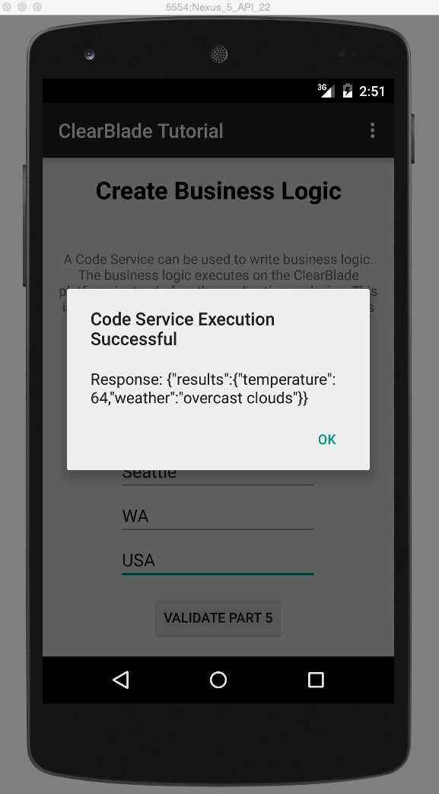</img> 

Lessons Learned -   
- How to connect to collections in a service   
- Basic javascript syntax  
- Leveraging the built-in ClearBlade library    


## Part 6 - Create a Library  

Developers always need to make reusable logic that can be leveraged across their applications.  In step 5 you used the built in library called ClearBlade.  You may also create new libraries that are available to all services in your system.  

1. Ensure you are on the code tab by clicking on the menu bar  
</img>  
2. Click the + New button to open the new service dialog  
</img>  
3. Name your library **“updateCityLibrary”**   
4. Change the Type of service to **“Library”** using the dropdown  
</img>  
5. Click **“Create”**  
6. In the newly created library copy and paste the following code in the new library and confirm the collectionName is the same as the collection you created earlier: 

```javascript
var getWeather = function(city, callback){
    var requestObject = ClearBlade.http().Request();
    var options = {
        uri: "http://api.openweathermap.org/data/2.5/weather?q="+city+"&units=imperial&APPID=4b7403db83c14490daa37a57b722743f",
        strictSSL: false,
        headers: {
            'Accept': 'application/json'
        }
    };
    requestObject.get(options, function(err, response) {
        callback(err, JSON.parse(response));
    }); 
};


var saveWeather = function(item_id, temp, description, callback){
    
    var cityWeather = {"temperature":temp,"weather":description};
    var q = ClearBlade.Query({collectionName:'Weather'});
    q.equalTo('item_id', item_id);
    var callCallback = function (err, data) {
        callback(err, data);
    };
    q.update(cityWeather, callCallback);
};
```

This code contains two new functions  
 - getWeather - which looks up the weather for a city using a third party http library  
 - saveWeather - saves the results of the weather lookup to the collection  
7. Open the setting for the updateCityLibrary by clicking the wrench icon  
8. On the Requires tab add the **‘http’** library and Apply  
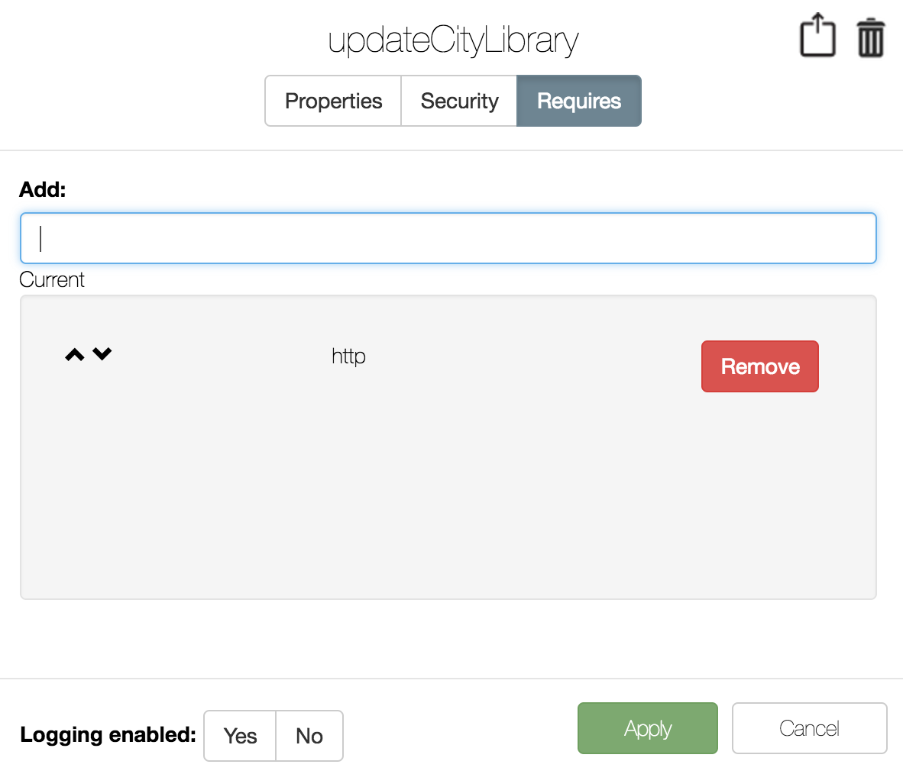</img>  
9. Continue by creating a new service to test your library. Click the **'+New{}'** button  
10. Name the service **“ServicePart6”**  
11. Add these 3 params: city, state, and country.  
12. Create a new service, ‘ServicePart6’ and copy and paste the following code into your new service.  This code will build off of the service defined in part 5 but now also include calls to your custom library.    

```javascript
function ServicePart6(req, resp){
    
    var city = req.params.city;
    var state = req.params.state;
    var country = req.params.country;
    
    var setWeather = function(item_id, city) {
        var temp= 30;
        var description="unset"
        var saveWeatherCallback = function(err, data) {
            
            if (err) {
                resp.error(data);
            } else {
                resp.success(city+" weather is "+description+" and "+temp+" °F");
            }
        };
        var getWeatherCallback = function(err, data) {
            temp = Math.round(data.main.temp);
            description = data.weather[0].description;
            saveWeather(item_id, temp, description, saveWeatherCallback)
        };
        getWeather(city, getWeatherCallback);
    };
   
    
    var updateCollection = function() {
        var collection = ClearBlade.Collection({collectionName:"Weather"});
        var newRow = {
            city: city,
            state: state,
            country: country,
            temperature: 70,
            weather: 'Sunny'
        };
        var callback = function(err, data) {
            if (err) {
                resp.error(data);
            } else {
                setWeather(data.DATA[0].item_id, data.DATA[0].city);
            }
        };
        collection.create(newRow, callback);
    };
    
     var cityCallback = function(err, data){
        if (err) {
            resp.error(data);
        }
        else {
            if (data.DATA.length === 0) {
                updateCollection();
            } else {
                setWeather(data.DATA[0].item_id, data.DATA[0].city);
            }
        }
    };
    
    ClearBlade.init({request:req});

    var q = ClearBlade.Query({collectionName:"Weather"});
    q.equalTo("city", city);
    q.equalTo("state", state);
    q.equalTo("country", country);
    q.fetch(cityCallback);
}
```

13. In your new servicePart6 open the setting and be sure to require your new library along with the ClearBlade library and give the service 'Authenticated' user permissions    
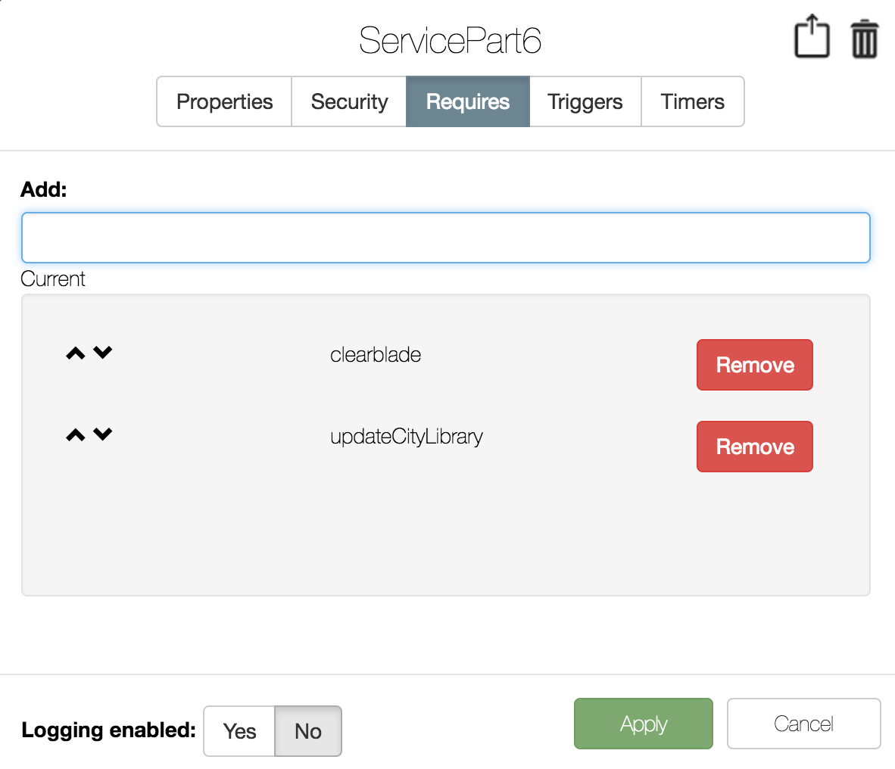</img>  
14. You can now complete Part 6 validation in your app   
15. After completing the validation, you can check whether the data has been saved to the collection  

Lessons Learned -   
- How to create libraries  
- Make raw http calls  


## Part 7 - Introduction to messaging  

Many apps want to accomplish more than just getting and showing data but provide a richer experience by having data pushed to them. The data that get sents to these apps can come from a variety of places - like IoT devices.  

To accomplish this richer experience the ClearBlade Platform provides a messaging protocol that can be used on devices on in web browsers.  Part 7 will explore what’s possible with ClearBlade secure scalable messaging.  

1. In your client app navigate to part 7.  
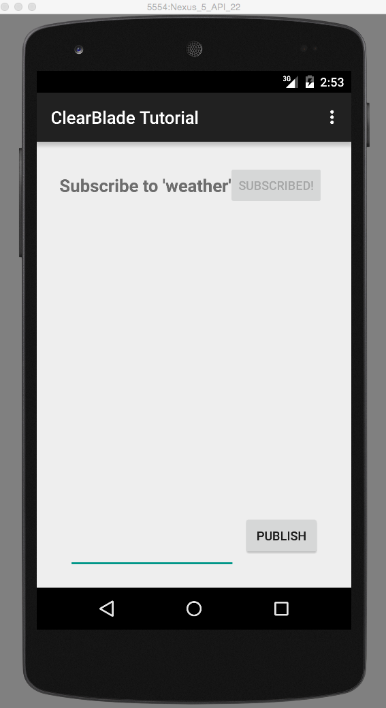</img>    
2. Click the subscribe button to have your client began to listen on the topic called “weather”  
3. Below the message box, test sending data across the messaging protocol by entering something in the message box and clicking publish.  

That payload has now been sent securely through the ClearBlade Platform instance and received back by the client you are working with  
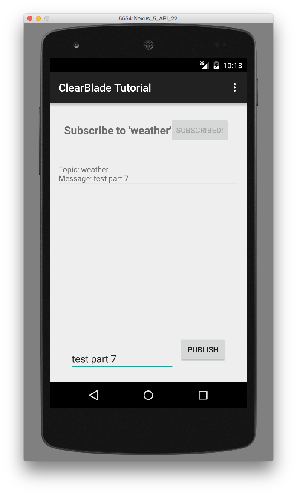</img>  
4. Validate result in app window by ensuring the message appears in your message box.  
5. We can also see the results of the message using the developer console.  Begin by clicking on the Message item on the menu bar.  
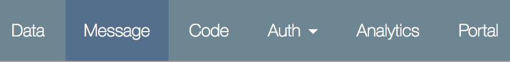</img>  
6. In the lists of topics find and click on “weather”  
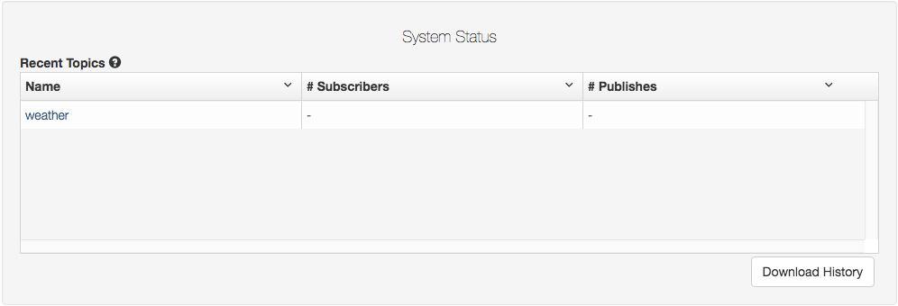</img>  
7. Check the messages published under the weather topic:  
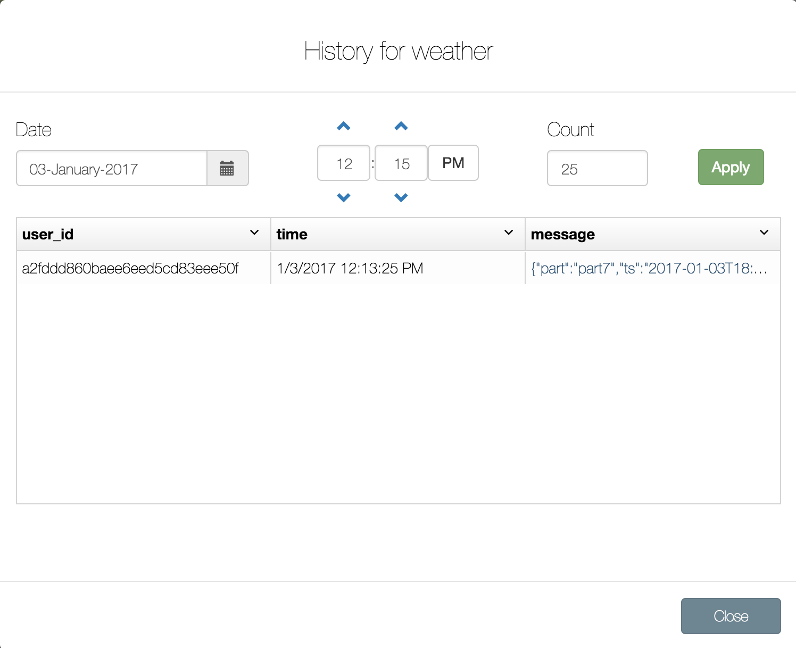</img>  

Lessons Learned -   
- The availability of messaging for publish subscribe activities  
- Message history is available for all topics within a system  
- Customization of payloads across the message protocol  
- Messaging support for browser and native device experiences  


## Part 8 - Messaging from Service  

To expand on messaging, it’s not always desired that your clients be the ones issuing messages.  Broadcasted information coming from your server can provide tremendous value in keeping all clients notified of changes and in sync.      

In Part 8 we will create a service that sends messages.  You will be able to see the result in the client you already have running.  

1. Ensure you are on the code tab by clicking on the menu bar  
</img>  
2. Click the + New button to open the new service dialog  
</img>  
3. Name your library **“notifyLib”**  
4. Select the Code type to **Library**
5. Use the standard process for updating the service required libraries to include clearblade 
6. Copy and paste the following code:  

```javascript
var notify = function(message) {
  var messaging = ClearBlade.Messaging({}, function(){});
  messaging.publish("weather", message);
};
```

This code will send a basic message over the messaging protocol  on the topic called “weather”  
7. Next create a new service, **‘ServicePart8’** and copy and paste the following code   

```javascript
 function ServicePart8(req, resp){
    
    var getWeather = function() {
        
        var queryCallback = function(err, data) {
            
            if (err) {
                resp.error(data);
            } else {
                var message = {part:"part8", "ts": Date(), "value":data.DATA[0].city + " is " + data.DATA[0].temperature + " degrees and " + data.DATA[0].weather};
                notify(JSON.stringify(message));
                resp.success("Done");
            }
        }
        
        var query = ClearBlade.Query({collectionName:"Weather"});
        query.equalTo('city', 'Austin');
        query.fetch(queryCallback);
    };
    
    ClearBlade.init({request:req});
    getWeather();
    
}
```

8. In the newly create servicePart8 open the settings and update the requires to include the libraries **‘clearblade’** and **‘notifyLib’**  
</img>  
9. This service does its own initialization so that it doesn’t need a caller user token to run calls against the data.  It can be tested directly from the console  
10. Click the button “Save and Test”  
</img>  
11. Look in your client app and validate the message from Part 8 now appears in your message box.  
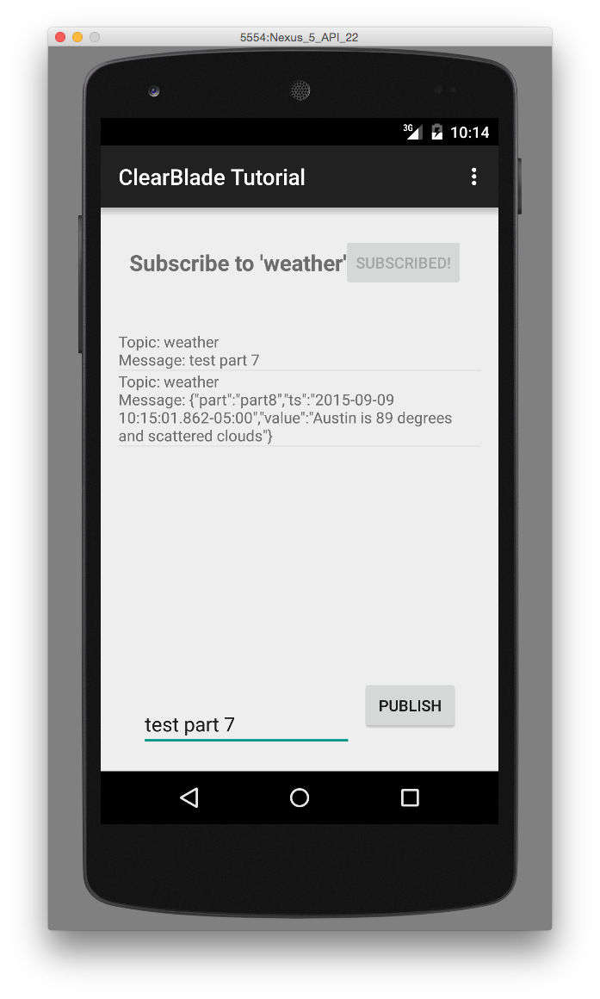</img>  
12. Validate in the console in the message history tab  
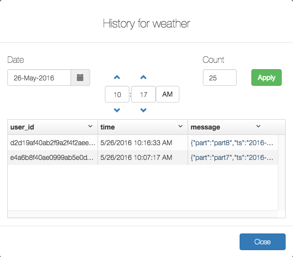</img>  

Lessons Learned -   
- Messaging can be sent via a service  


## Part 9 - Create a Trigger  

Now that you have brought together the basic of building your own API that includes data, live interactions with business logic you can explore the richness that occurs when these attributes are unified.  ClearBlade Platform triggers allow for you as a developer to identify certain events and automatically trigger an action.    

This capability can be used to keep large numbers of clients in sync when a single data source changes or to invoke asynchronous data analysis.  

1. Begin by create a new service called **ServicePart9Trigger** and copy and paste the following code:  

```javascript
function ServicePart9Trigger(req, resp){
    ClearBlade.init({request:req});
    notify(JSON.stringify({part:"part9", req:JSON.stringify(req)}));
    resp.success("done")
}
```  

2. Update the settings of the new service by clicking the wrench icon and require the **notifyLib** and **clearblade** libraries  
</img>  
3. Before leaving the settings dialog go to the Triggers Tab  
4. Using the trigger UI create a new trigger that causes the service to run each time the weather collection has a create event called.  
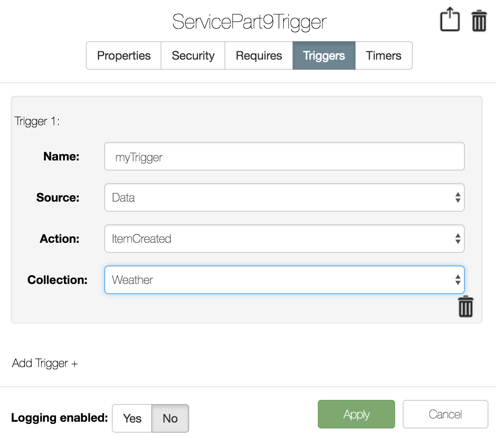</img>  
5. We need the ability to test this new trigger so create another service named **ServicePart9Caller** and copy and paste the following code: 

```javascript
function ServicePart9Caller(req, resp){
    var city = "Seattle";
    var state = "WA";
    var country = "USA";
    
    var updateCollection = function(Temp, desc) {
        var collection = ClearBlade.Collection({collectionName:"Weather"});
        var newRow = {
            city: city,
            state: state,
            country: country,
            temperature: parseInt(Temp),
            weather: desc
        };
        var callback = function(err, data) {
            if (err) {
                resp.error(data);
            } else {
                resp.success("done");
            }
        };
        collection.create(newRow, callback);
    };
    
    var getWeatherCallback = function(err, data) {
        var temp = data.main.temp;
        var description = data.weather[0].description;
        updateCollection(temp, description);
    };
    ClearBlade.init({request:req});
    getWeather(city, getWeatherCallback);
}
```

6. Using the settings on this new service update the requires to include updateCityLibrary and clearblade  
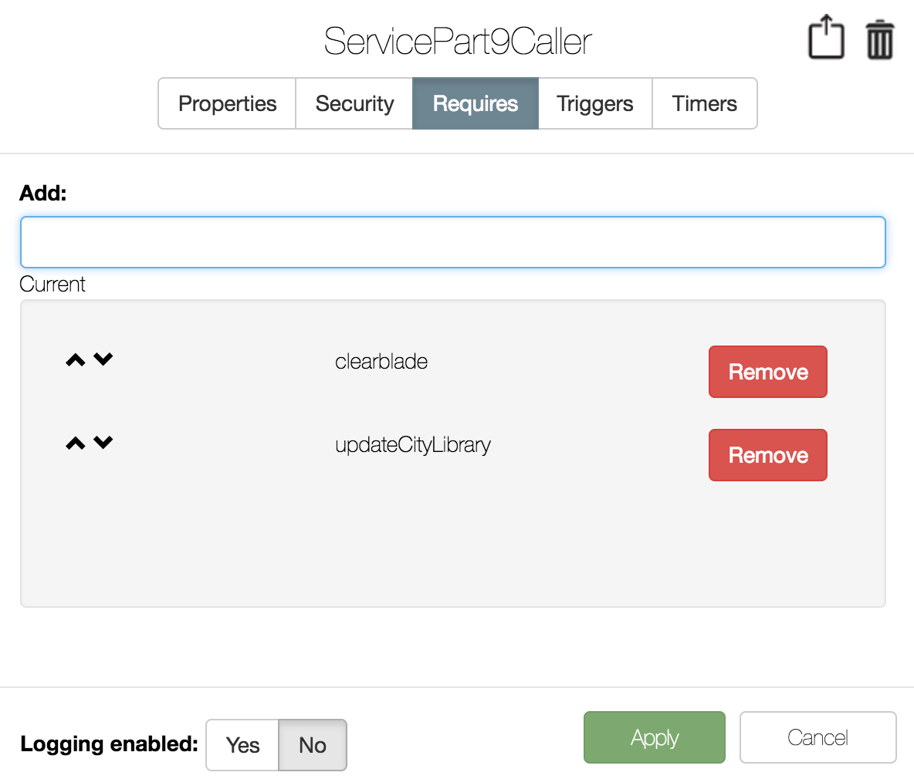</img>   
7. Now click the “Save and Test” button to execute the ServicePart9Caller from the console. When this service runs it should create in the Weather collection and consequently trigger your trigger event.  If everything has gone to correctly, you should now see a part 9 entry in your app.  
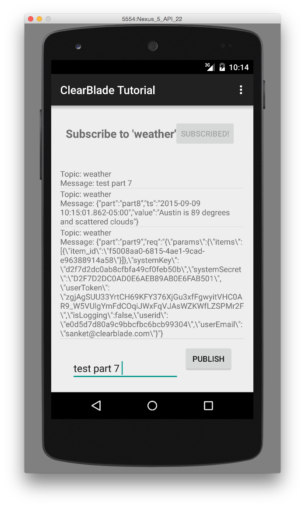</img>  
8. Dont forget to verify that your console also tracked the event by using the Messaging tab  
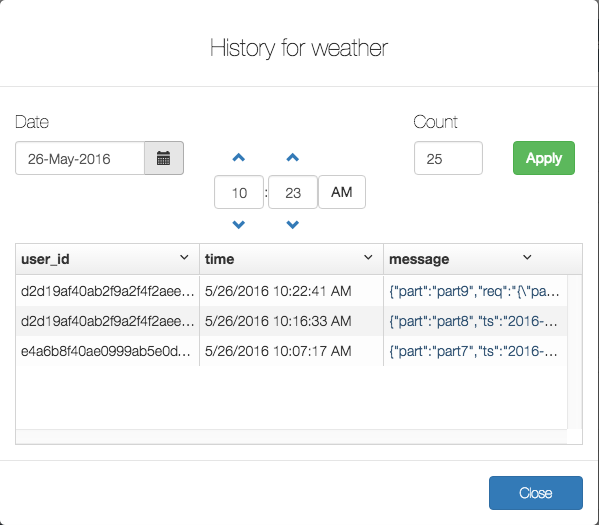</img>

Lessons Learned -   
- Triggers are applied to services  
- When a trigger is called it passed data into the service describing the event that called it  
- Triggers provide a unifying capability across all activities in your system  


## Part 10 - Create a Timer  

Now that we are reacting to events within the ClearBlade platform it becomes equally important to start scheduling activities.  ClearBlade provides the ability to set Timers on services that can run with both varying frequency and repition.  This capability mirrors what enterprises do today with batch jobs but also looks familiar to users of cloud services that monitor uptime and availability of infrastructure.  

In Part 10 we will create a time that causes a service to run every 10 seconds 30 times  

1. From the Code tab click the New button to launch the new service dialog  
2. Name the service **ServicePart10**  
3. Copy and insert the following code into the newly created service 
 
```javascript
function ServicePart10(req, resp){
    ClearBlade.init({request:req});
    var message = {part:"part10", "ts": Date(), "message": "Service executing every 10 seconds"};
    notify(JSON.stringify(message));
    resp.success("done");
}
```   

4. Add administrator to your test user's roles
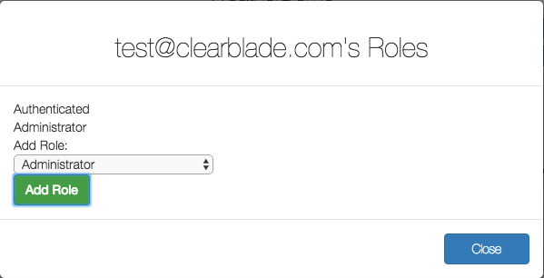</img>
5. Set the service security to administrator
6. Leave "Run as" blank  
7. Use the standard process for updating the service required libraries to include **clearblade** and **notifyLib**  
8. Test the service in the console by clicking the Save and Test button  
9. Click on the wrench icon and go to the Timers tab  
</img>    
10. Set the timer to run the service every 10 seconds  
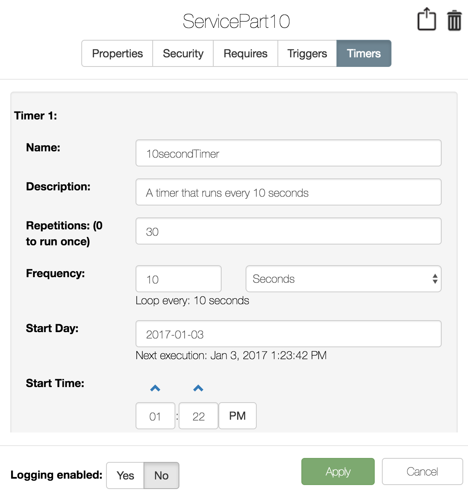</img>  
11. In your client you should now see 10 entries showing the execution of the timer.  
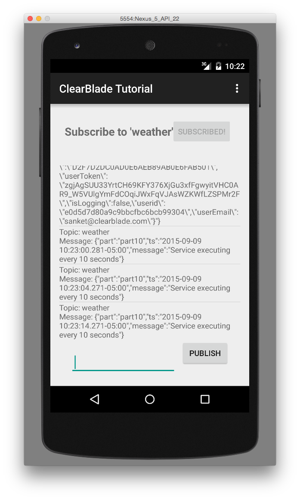</img>  

Lessons Learned -   
- Timers are applied to services  
- When a timer is called it passed data into the service describing the event that called it  
- Timers provide a more traditional unifying capability across the capabilities of your system  


## Part 11 - View Analytics  

With each action you have been completing during this tutorial the ClearBlade platform has been building up a store of event and history. This information makes up vital information that can be fed into analytics tools provided by ClearBlade partners.  These partners can identify usage trends, penetration attempts, and any number of device patterns.  

Most important a REST API exist for access all the analytics stored in the ClearBlade Platform.  

Explore the visualization of this data from the analytics tab      
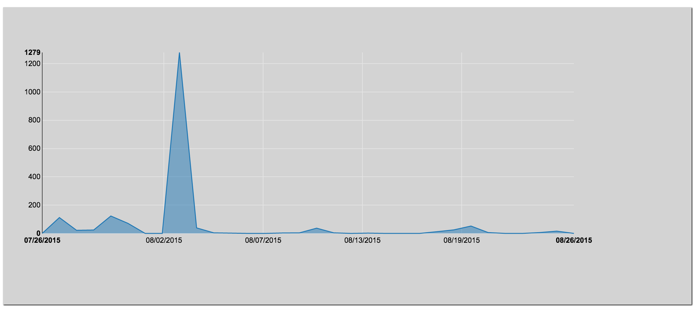</img>  

### What’s Next  

1. Create a [Portal](../../../5-portal/portal_getting_started) and begin to visualize the data within your ClearBlade Platform instance
2. Familiarize yourself with the raw APIs at the swagger  
 [Swagger/Analytics](../../../static/restapi/index.html#!/analytics) 
3. Familiarize yourself with samples - tank, chats  
4. Learn about the integrations available - Sockets, Files  
5. Review the CLI and development best practices  
6. Install about the system patterns for IoT, Social, SalesForce, AS400 and others  
7. Communicate on the forums 
